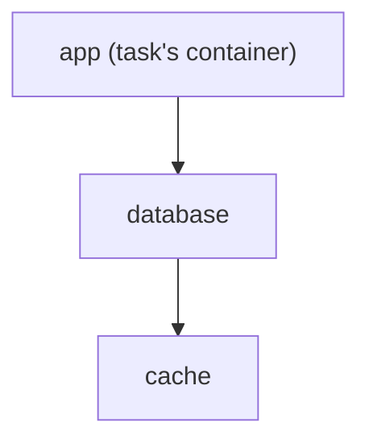
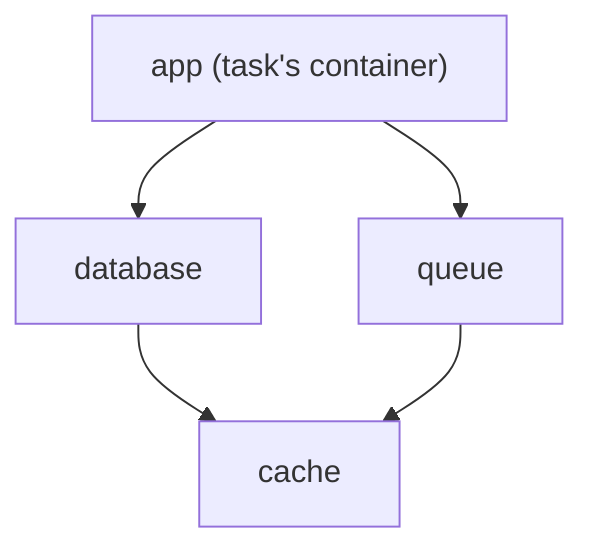
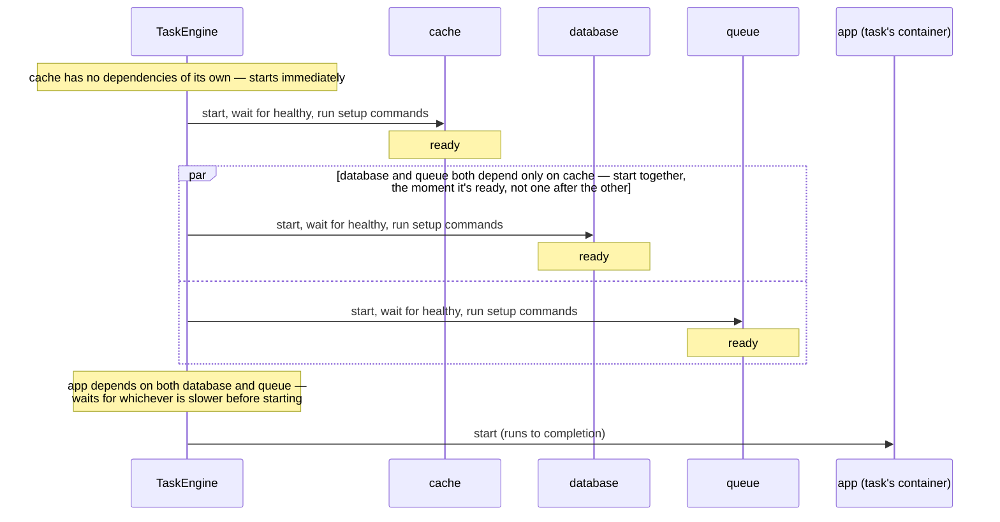

# Dependency Readiness

A dependency container being *started* doesn't mean it's *ready* — a database
accepts connections some time after its process launches. This page is the one
place for what "ready" means, how Ratect waits for it, and how several
dependencies' waits combine into one task's start-up. The fields themselves
(`dependencies`, `health_check`, `setup_commands`) are in the [`batect.yml`
reference](ratect-compat-config-reference.md#dependency-readiness); they mean
exactly the same thing in a `ratect.toml` (see [Field
reference](ratect-config-reference.md#field-reference)), which is what the
running example is written in.

That example, throughout, is
[`examples/full-stack`](https://github.com/or1can/ratect/tree/main/examples/full-stack)'s
`db` container — a real `postgres:16` gated on `pg_isready`, whose init script
bulk-seeds a million-row table, and which then runs a real `setup_commands`
entry once it's healthy:

```toml
{{#include ../examples/full-stack/ratect.toml:readiness-db}}
```

`app` depends on `db` and on `cache` (a `redis:7` with its own health check),
and the `journey-test` task depends on `app` and, again, on `cache`. `app`
itself is checked a third way — an
[`external_health_check`](ratect-config-reference.md#external_health_check-checking-a-container-from-outside-it)
requesting `/healthz` from outside it, which reports exactly as the other two
do. `ratect run
journey-test -o simple`, captured on a terminal in `examples/full-stack`:

```ansi
{{#include captures/output-styles-simple.ansi}}
```

The recording on the [homepage](index.md) is the same command in `fancy` mode.
`db` takes longer than `cache` because it's genuinely seeding that table before
its health check can pass, not because anything is padded. The rest of this page
is what the lines between `Starting db...` and `Starting app...` mean.

## The two gates

Matching Batect, a dependency must pass two gates, in order, before anything
that depends on it (another dependency, or the task's own container) starts:

1. **It must report healthy.** If the container has a Docker health check — from
   its image's own `HEALTHCHECK`, from the `health_check` field, or both — Ratect
   waits for Docker's verdict: proceeds on *healthy*; fails the task on
   *unhealthy* (the error includes the last health-check run's exit code and
   output) or if the container exits first. A container with no health check at
   all is immediately considered healthy — for it, started *is* ready. In the
   transcript, this
   gate is the gap between `Started db.` and `db has become healthy.`

   This gate is Docker's own health check, so it needs a shell and a check tool
   *inside* the image. If yours has neither — a distroless or `scratch` build —
   a `ratect.toml` container can be checked from outside instead, with
   [`external_health_check`](ratect-config-reference.md#external_health_check-checking-a-container-from-outside-it).
2. **Its `setup_commands` must succeed.** Each runs inside the running container
   (via Docker's `exec` mechanism), one at a time in declared order, with the
   container's own `environment` and (under [User
   mapping](ratect-compat-config-reference.md#user-mapping)) the same user/group
   the container runs as. A command exiting non-zero fails the task, with its
   output in the error. In the transcript, `Running setup command psql -U
   postgres -c "ANALYZE visits;" (1 of 1) in db...` is this gate, and `Starting
   app...` doesn't appear until `db has completed all setup commands.`

A `ratect.toml` setup command can run *somewhere else*:
[`run_in`](ratect-config-reference.md#run_in-setup-commands-in-another-container)
(`ratect`-native only) names one of the declaring container's own dependencies
to exec into instead, for the case where the tooling a setup step needs lives in
a different image — seeding a database from a client container, say. When it
runs is unchanged: it is still gate 2 of the container that declares it, so
nothing depending on that container starts until it has succeeded. The
restriction to that container's own dependencies is what makes it safe, and is
explained in that field's own section.

Whichever gate fails, the task fails, and already-started containers are still
cleaned up as usual.

A `ratect.toml` dependency can opt into a different readiness gate entirely:
[`run_to_completion`](ratect-config-reference.md#run_to_completion-init-containers)
(`ratect`-native only — `batect.yml` has no equivalent) replaces "healthy, then
setup commands" with running to completion and exiting 0 — Kubernetes-style
init-container behavior, still just a node in the same dependency graph
described below. It participates in resolution exactly like any other
dependency (concurrent with an unrelated branch, deduplicated if shared,
nestable either directly under a task's own `dependencies` or under another
dependency's); the only difference is what "ready" means for it. What it
rejects, and why it isn't a substitute for `prerequisites`, is in that field's
own section.

A `ratect.toml` container can also be checked *from outside itself*:
[`external_health_check`](ratect-config-reference.md#external_health_check-checking-a-container-from-outside-it)
(`ratect`-native only) makes an HTTP request or a bare TCP connection to the
container over the project's own network, for an image with no shell and no
check tooling to run gate 1 with — a distroless or `scratch` build. The two
are different concepts rather than two spellings of one: `health_check` *is*
Docker's own `HEALTHCHECK`, owned by the daemon and re-run for the container's
whole lifetime, while this is closer to a Kubernetes *readiness* check — asked
once, from outside, with no opinion about the container's health afterwards.
(Ratect has no equivalent of a *liveness* check in either form.) It is
config-level sugar over `run_to_completion` rather than a third kind of gate:
declaring one generates a companion container that loops the check and exits
0 or non-zero, and everything that depended on the checked container depends
on that companion too. None of that surfaces — the companion narrates nothing
of its own, and the checked container reports `has become healthy.` when the
check passes, exactly as it would for a `health_check`. So the resolution
described below is unchanged.

## How Docker reaches its verdict

This is Docker's own behavior, not Ratect's, but it's what actually determines
how long the first gate waits and when it fails, so it's worth spelling out:

- A freshly started container with a health check isn't unhealthy — it's in a
  third state, **`starting`**, until Docker reaches a first verdict. Docker runs
  `command` every `interval`; the first success makes the container *healthy*,
  and only `retries` **consecutive** failures make it *unhealthy*. With `db`'s
  settings above (`interval = "1s"`, `retries = 90`), the earliest possible
  unhealthy verdict is about ninety seconds in — a health check can't "fail
  fast" on its first bad run, and `db`'s generous `retries` is exactly what
  gives its million-row seed the time it needs.
- Failures during `start_period` don't count toward `retries` at all — that's
  the grace period for slow-booting services — but a success during it still
  flips the container healthy immediately.
- Ratect waits for that first verdict, and **only** the first: matching Batect,
  a dependency's health is never re-checked once its dependents have started,
  even though Docker keeps running the check for the container's whole lifetime
  and the state can flip later. See [Once ready](#once-ready) below for what
  Ratect does instead.

While a task appears to hang on a dependency, `docker ps` shows each container's
health state in its `STATUS` column (`health: starting`, etc.), and
`docker inspect --format '{{.State.Health.Status}}' <container>` shows it
directly — `.State.Health.Log` keeps the last few check runs' exit codes and
output, which is also where the detail in Ratect's "did not become healthy"
error comes from.

Ratect imposes no timeout of its own on the health wait (matching Batect) —
Docker's own `interval`/`retries` bound how long a verdict can take, so a health
check configured to retry forever waits forever.

## Resolution order

Dependencies are resolved **concurrently, gated by readiness**: a container with
dependencies of its own never starts before every one of them is ready, but two
containers with no dependency relationship to each other start at the same time
rather than one after the other. For example:

```toml
[containers.app]
image = "my-app"
dependencies = ["database"]

[containers.database]
image = "postgres:16"
dependencies = ["cache"]

[containers.cache]
image = "redis:7-alpine"
```



Running a task against `app` starts `cache` first (nothing else is holding it
back), then `database` once `cache` is ready, then `app` once `database` is
ready — a straight chain, so each one is genuinely waiting on the last. All
three share one network and are reachable by their container-config name (e.g.
`app`'s command can reach `database:5432` and `cache:6379`).

Add a second container that also depends on `cache` — say `queue`, also one of
`app`'s dependencies, but with no relationship to `database` — and `cache` is
now a **shared dependency** of two others, forming a diamond rather than a
straight chain:





`cache` is only ever started **once**, even though both `database` and `queue`
depend on it: whichever of the two reaches it first triggers the actual start,
and the other waits on that same in-flight readiness rather than starting a
second instance or pulling its image twice (see below — this holds generally,
not just for a leaf like `cache`). `database` and `queue` then
genuinely overlap in time — both start the moment `cache`'s readiness gate has
actually passed, not just once its container exists, and neither waits on the
other since they share no relationship. `app` is gated on whichever of the two
takes longer, not just the first one to finish.

`examples/full-stack` has the same ingredients with real names: `journey-test`
depends on `app` and `cache`, and `app` depends on `db` and `cache`. `db` and
`cache` are unrelated branches, so the transcript above starts them together;
`app` waits on both, so `Starting app...` follows `db has completed all setup
commands.`; and `cache`, reached by `journey-test` directly and by `app`, starts
once.

More generally, within one task's resolution *any* dependency shared by two
others — not just a leaf like `cache` — is only ever started once, no matter how
many dependents reach it or how deep in the graph they sit, including when they
reach it genuinely concurrently: the second to arrive waits on the first's
already-in-flight readiness rather than starting a second instance or
double-pulling its image. A circular container dependency (`a` depends on `b`
depends on `a`) is detected up front, before any container starts, and reported
as an error rather than hanging.

This concurrency is unbounded by default — every independent branch's
pull/build, create+start, and setup commands can all be in flight at once,
across the whole invocation, not just within one task. `--max-parallelism <N>`
caps it: at most `N` of those specific operations run at a time,
invocation-wide. The health-check wait itself is deliberately *not* capped (it's
a polling wait, not real work), so two dependencies can still become healthy at
the same time even under a low cap — only the pull/build/start/setup-command
steps queue up behind it. See [CLI reference](ratect-compat-cli.md#task-execution) and
[differences from Batect](differences-from-batect.md#cli-flags) for exactly
what's covered.

A task's own `dependencies` (sidecars scoped to that task specifically) join
this same resolution at the root, alongside its container's own — each still
resolves its *own* container-level `dependencies` transitively from there, same
as any other dependency, and is just as eligible to start concurrently with an
unrelated branch. And a task's `customise` map, if it has one, is checked
against whichever dependency is starting: a match overrides that container's
`environment`/`ports`/`working_directory` for this task's run of it
specifically (merged the same way a task's own `run` overrides its main
container — see [config
reference](ratect-compat-config-reference.md#taskcontainercustomisation)),
before it starts, regardless of how deep in this graph it sits.

## Once ready

Health is a **one-time gate in this sequence, not ongoing monitoring** (the
verdict lifecycle above): a dependency that turns unhealthy after its
dependents have started doesn't affect the rest of the task.

Not re-checking health doesn't mean staying silent, though: a dependency that
has already become ready and then exits on its own — while the task's own
command, or a later dependency's own health/setup wait, is still going — prints
a warning naming the container and its exit code, in every output mode. Without
it, that container's own death would otherwise surface later as a confusing
symptom in whatever *depended* on it (a connection refused, a timeout) rather
than the real cause. This is a notification only — the run isn't failed or
stopped because of it — and it's never printed for a container cleanup itself
stops: Ratect stops watching a dependency for this the moment the task's own
execution finishes, strictly before cleanup ever touches a container. This
warning doesn't apply to a `run_to_completion` dependency either: its exit is
how it *became* ready in the first place, not a later surprise, so there's
nothing unexpected to report.

## The task's own container

The task's own container goes through this same readiness gate too,
run concurrently with its main command rather than gating anything on it —
matching Batect, which runs every container through identical per-container
steps, task container included. What a failure there means for the task, the
one race that leaves open, and where Ratect differs from Batect on it are in
[known
limitations](task-lifecycle.md#known-limitations)
and [Differences from Batect](differences-from-batect.md#container-fields).
