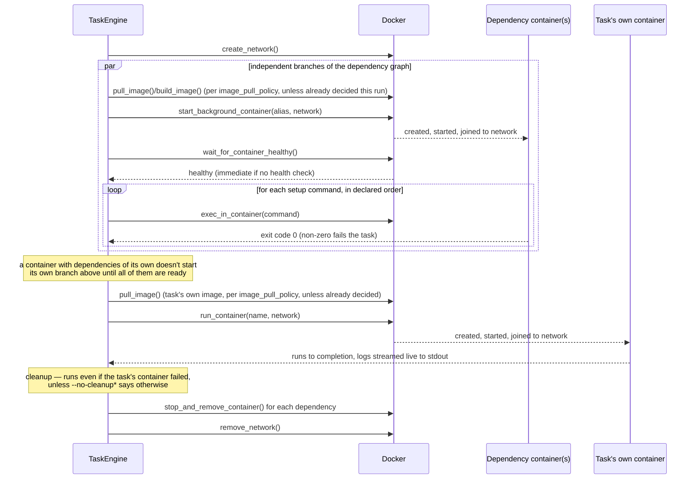
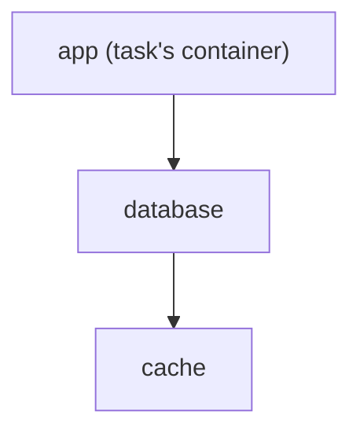
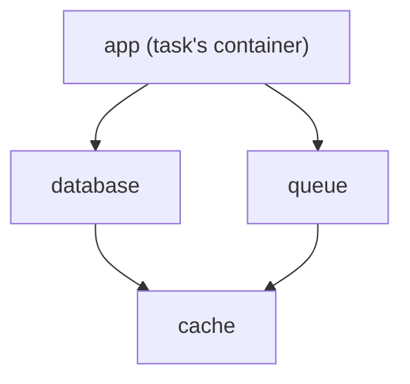
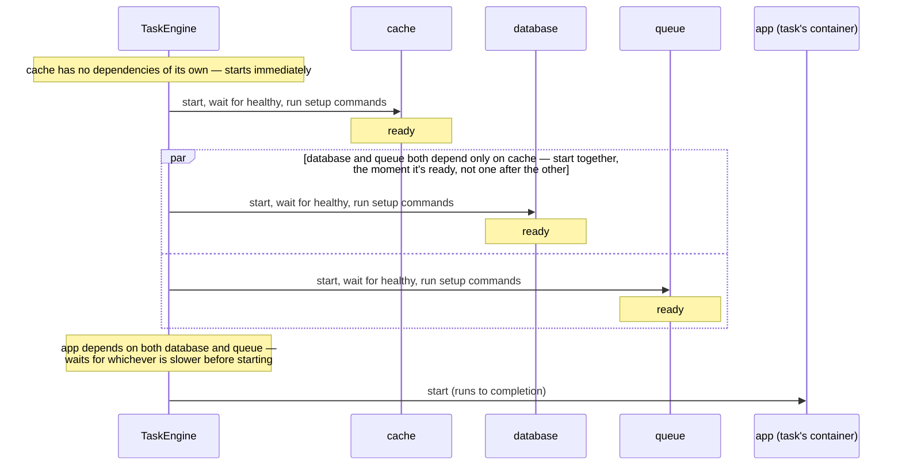

# Task Lifecycle

This is the detailed, step-by-step version of what `ratect <task>` actually does,
covering dependency (sidecar) container resolution and cleanup in depth. For the
broader architecture (config loading, CLI parsing, logging), see
[how it works](how-it-works.md); this page is the equivalent of Batect's own
[task lifecycle](https://github.com/batect/batect.dev/blob/main/docs/concepts/task-lifecycle.mdx)
page, describing Ratect's own (deliberately simplified) version of the same idea.

## Task ordering

Ratect only ever runs **one task's containers at a time**. A task's `prerequisites`
just order sequential task executions — each prerequisite task runs to completion
(including its own cleanup, described below) before the next one starts, and before
the originally-requested task itself runs.

```yaml
tasks:
  compile:
    run:
      container: build-env
      command: ./build.sh
  test:
    prerequisites:
      - compile
    run:
      container: build-env
      command: ./test.sh
```

Running `ratect test` here runs `compile` to completion first, fully cleaning up
after it, then runs `test`.

A task doesn't strictly need a `run` of its own — a task with only `prerequisites`
is valid (see [config reference](config-reference.md#task)), and exists purely to
chain other tasks together:

```yaml
tasks:
  ci:
    prerequisites:
      - compile
      - test
```

Running `ratect ci` here runs `compile` then `test` to completion, same as above,
then stops — there's no container of `ci`'s own left to run.

## Per-task steps

Every task execution gets its own Docker network, whether or not its container
declares `dependencies` — so a task's container is never left running on Docker's
shared default bridge network, reachable by or able to reach anything else on the
host. If the container *does* declare `dependencies`, those are started on that
network *before* the task's own container, so the task's container can reach them by
name — and so is anything named in the *task's own* `dependencies` (sidecars scoped
to this task specifically, distinct from the container-level field — see [config
reference](config-reference.md#task)), unioned in alongside the container-level ones.
All of this — network, dependencies, and the task's own container — is scoped
to **this one task execution** and torn down before moving on, regardless of whether
the task succeeded — unless `--no-cleanup`/`--no-cleanup-after-failure`/
`--no-cleanup-after-success` says otherwise, in which case everything below is left
genuinely running instead, for investigation (see [CLI
reference](cli-reference.md)):



If the container has no `dependencies`, the dependency steps (the `loop` above) are
skipped — but the network is still created and the task's own container still joins
it, isolating it just the same as a task with dependencies.

`--no-cleanup-after-failure` skips the cleanup step above for a genuine infrastructure
failure (a build/pull/health-check/setup-command failure, or anything else before the
task's own container gets to run); `--no-cleanup-after-success` skips it when the
task's own container ran to completion instead, regardless of its exit code (a
non-zero exit is still "success" for this purpose — it's the task's own container
actually running that matters, not what it returned); `--no-cleanup` is both at once.
Either way, everything above is left genuinely running, not just present-but-stopped
— see [CLI reference](cli-reference.md).

`pull_image()` in the diagram above is conditional on `image_pull_policy` (see [config
reference](config-reference.md#container)): `IfNotPresent`, the default, checks whether
the image already exists locally first and skips the pull entirely if so; `Always`
skips that check and pulls unconditionally. Either way, the *decision* (pull or don't)
is made once per image name per `ratect` invocation, same as before this field
existed — a dependency and the task's own container sharing an image name don't
re-decide for each other.

Passing `--use-network <name>` skips network creation and teardown entirely for every
task in this invocation: the named network is checked to exist up front (a clear error
if it doesn't), and reused instead — dependencies and the task's own container all join
it exactly as they would a freshly-created one, but it's never removed at cleanup,
since Ratect didn't create it. See [CLI reference](cli-reference.md).

## Dependency resolution

Dependencies are resolved **concurrently, gated by readiness**: a container with
dependencies of its own never starts before every one of them is ready (see below),
but two containers with no dependency relationship to each other start at the same
time rather than one after the other. For example:

```yaml
containers:
  app:
    image: my-app
    dependencies:
      - database
  database:
    image: postgres:16
    dependencies:
      - cache
  cache:
    image: redis:7-alpine
```



Running a task against `app` starts `cache` first (nothing else is holding it back),
then `database` once `cache` is ready, then `app` once `database` is ready — a
straight chain, so each one is genuinely waiting on the last. All three share one
network and are reachable by their container-config name (e.g. `app`'s command can
reach `database:5432` and `cache:6379`).

Add a second container that also depends on `cache` — say `queue`, also one of
`app`'s dependencies, but with no relationship to `database` — and `cache` is now a
**shared dependency** of two others, forming a diamond rather than a straight chain:





`cache` is only ever started **once**, even though both `database` and `queue` depend
on it: whichever of the two reaches it first triggers the actual start, and the other
waits on that same in-flight readiness rather than starting a second instance or
pulling its image twice (see below — this holds generally, not just for a leaf like
`cache`). `database` and `queue` then genuinely overlap in time — both start the
moment `cache`'s readiness gate has actually passed, not just once its container
exists, and neither waits on the other since they share no relationship. `app` is
gated on whichever of the two takes longer, not just the first one to finish.

This concurrency is unbounded by default — every independent branch's pull/build,
create+start, and setup commands can all be in flight at once, across the whole
invocation, not just within one task. `--max-parallelism <N>` caps it: at most `N` of
those specific operations run at a time, invocation-wide. The health-check wait itself
is deliberately *not* capped (it's a polling wait, not real work), so two dependencies
can still become healthy at the same time even under a low cap — only the pull/build/
start/setup-command steps queue up behind it. See [CLI
reference](cli-reference.md#options) and [differences from
Batect](differences-from-batect.md#cli-flags) for exactly what's covered.

A task's own `dependencies` (sidecars scoped to that task specifically) join this
same resolution at the root, alongside `app`'s own — each still resolves its *own*
container-level `dependencies` transitively from there, same as any other
dependency, and is just as eligible to start concurrently with an unrelated branch.
And a task's `customise` map, if it has one, is checked against whichever dependency
is starting: a match overrides that container's `environment`/`ports`/
`working_directory` for this task's run of it specifically (merged the same way a
task's own `run` overrides its main container — see [config
reference](config-reference.md#taskcontainercustomisation)), before it starts,
regardless of how deep in this graph it sits.

Started isn't ready, though: each dependency must become **ready** before whatever
depends on it starts — it must report healthy (immediately so for a container with no
Docker health check at all, from neither its image nor the `health_check` field), and
then every one of its [`setup_commands`](config-reference.md#dependency-readiness)
must succeed, in declared order. In the example above, `database`'s migrations (a
setup command) provably finish before `app`'s command gets to run. A dependency
that's reported unhealthy — or that exits before a verdict, or whose setup command
exits non-zero — fails the task; already-started containers are still cleaned up as
usual.

Health is a **one-time gate in this sequence, not ongoing monitoring**: Ratect waits
for Docker's *first* health verdict and never re-checks — matching Batect, a
dependency that turns unhealthy after its dependents have started doesn't affect the
rest of the task, even though Docker itself keeps running the check for the
container's whole lifetime. How long the wait for that first verdict can take (and
why an unhealthy verdict can't arrive quickly) is Docker's own verdict lifecycle —
see [How Docker reaches its verdict](config-reference.md#how-docker-reaches-its-verdict)
in the config reference.

More generally, within one task's resolution *any* dependency shared by two others —
not just a leaf like `cache` above — is only ever started once, no matter how many
dependents reach it or how deep in the graph they sit, including when they reach it
genuinely concurrently: the second to arrive waits on the first's already-in-flight
readiness rather than starting a second instance or double-pulling its image. A
circular container dependency (`a` depends on `b` depends on `a`) is detected up
front, before any container starts, and reported as an error rather than hanging.

## Cross-task isolation

Because dependency resolution is scoped to a single task execution, **two different
tasks that each depend on the same container name get their own separate instance** —
nothing is shared or deduped across tasks, even within one `ratect` invocation:

```yaml
tasks:
  migrate:
    run:
      container: app
      command: run-migrations.sh
  test:
    prerequisites:
      - migrate
    run:
      container: app
      command: run-tests.sh
```

Both `migrate` and `test` here depend on `database` (via `app`'s container config).
Running `ratect test` starts a `database` instance, its own network, runs `migrate`,
cleans both up — then starts a *second*, independent `database` instance and network
for `test`. This matches Batect's own documented behavior ("each task will start its
own instance of each container, even if multiple tasks share the same container") and
is also what makes concurrent `ratect` invocations on the same host safe: each task
execution's network is named with a random UUID, so there's no risk of two runs
colliding.

## Known simplifications relative to Batect

- **The task's own container skips the readiness steps.** Its `health_check` is
  applied (Docker records and runs it) but nothing waits on the verdict, and its
  `setup_commands` don't run at all — Batect runs every container through the same
  per-container steps, task container included (concurrently with its command) — see
  [differences from Batect](differences-from-batect.md#container-fields).
- **Prerequisite tasks stay sequential, matching Batect exactly** — `prerequisites`
  entries run one after another, each to completion, never concurrently with each
  other or with the task that named them (see "Task ordering" above). This is Batect's
  own behavior (`TaskExecutionOrderResolver`/`SessionRunner`), not a Ratect
  simplification — Batect doesn't parallelize independent prerequisite tasks either.
  Running independent prerequisites concurrently remains a possible Rust-specific
  enhancement beyond Batect, tracked under [Rust
  Enhancements](../ROADMAP.md#rust-enhancements), not something planned currently.
- **Minimal networking.** The network created here exists only to make dependency
  containers reachable by name for the duration of one task (or, with
  `--use-network`, an existing network you reuse instead). It's not the
  fully-configurable Docker networking Batect offers (custom drivers, other than by
  pre-creating the network yourself) — see
  [differences from Batect](differences-from-batect.md).
