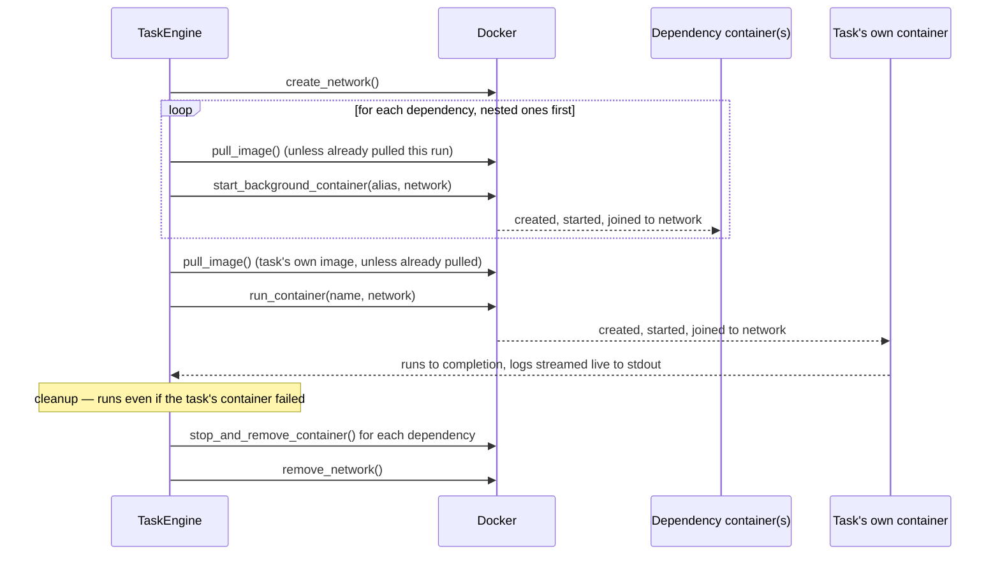
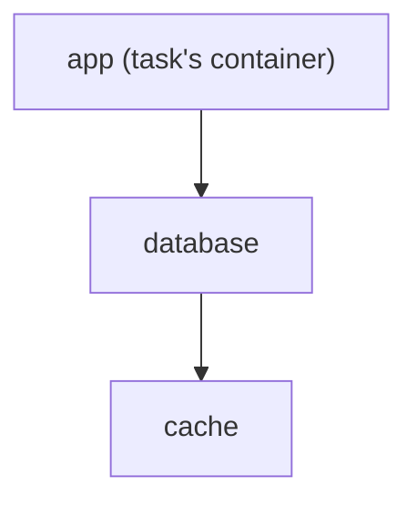

# Task Lifecycle

This is the detailed, step-by-step version of what `ratect <task>` actually does,
covering dependency (sidecar) container resolution and cleanup in depth. For the
broader architecture (config loading, CLI parsing, logging), see
[how it works](how-it-works.md); this page is the equivalent of Batect's own
[task lifecycle](https://github.com/batect/batect.dev/blob/main/docs/concepts/task-lifecycle.mdx)
page, describing Ratect's own (deliberately simplified) version of the same idea.

## Task ordering

Ratect only ever runs **one task's containers at a time**. A task's `prerequisites`
just order sequential task executions — each prerequisite task runs to completion
(including its own cleanup, described below) before the next one starts, and before
the originally-requested task itself runs.

```yaml
tasks:
  compile:
    run:
      container: build-env
      command: ./build.sh
  test:
    prerequisites:
      - compile
    run:
      container: build-env
      command: ./test.sh
```

Running `ratect test` here runs `compile` to completion first, fully cleaning up
after it, then runs `test`.

## Per-task steps

Every task execution gets its own Docker network, whether or not its container
declares `dependencies` — so a task's container is never left running on Docker's
shared default bridge network, reachable by or able to reach anything else on the
host. If the container *does* declare `dependencies`, those are started on that
network *before* the task's own container, so the task's container can reach them by
name. All of this — network, dependencies, and the task's own container — is scoped
to **this one task execution** and torn down before moving on, regardless of whether
the task succeeded:



If the container has no `dependencies`, the dependency steps (the `loop` above) are
skipped — but the network is still created and the task's own container still joins
it, isolating it just the same as a task with dependencies.

Passing `--use-network <name>` skips network creation and teardown entirely for every
task in this invocation: the named network is checked to exist up front (a clear error
if it doesn't), and reused instead — dependencies and the task's own container all join
it exactly as they would a freshly-created one, but it's never removed at cleanup,
since Ratect didn't create it. See [CLI reference](cli-reference.md).

## Dependency resolution

Dependencies are resolved **depth-first and recursively**: if a dependency's own
container config also declares `dependencies`, those are started first, on the same
task-scoped network. For example:

```yaml
containers:
  app:
    image: my-app
    dependencies:
      - database
  database:
    image: postgres:16
    dependencies:
      - cache
  cache:
    image: redis:7-alpine
```



Running a task against `app` starts `cache`, then `database`, then `app` — in that
order — all sharing one network, all reachable by their container-config name (e.g.
`app`'s command can reach `database:5432` and `cache:6379`).

Within one task's resolution, a dependency shared by two others (e.g. two containers
that both depend on `cache`) is only started **once**. A circular container dependency
(`a` depends on `b` depends on `a`) is detected and reported as an error rather than
hanging.

## Cross-task isolation

Because dependency resolution is scoped to a single task execution, **two different
tasks that each depend on the same container name get their own separate instance** —
nothing is shared or deduped across tasks, even within one `ratect` invocation:

```yaml
tasks:
  migrate:
    run:
      container: app
      command: run-migrations.sh
  test:
    prerequisites:
      - migrate
    run:
      container: app
      command: run-tests.sh
```

Both `migrate` and `test` here depend on `database` (via `app`'s container config).
Running `ratect test` starts a `database` instance, its own network, runs `migrate`,
cleans both up — then starts a *second*, independent `database` instance and network
for `test`. This matches Batect's own documented behavior ("each task will start its
own instance of each container, even if multiple tasks share the same container") and
is also what makes concurrent `ratect` invocations on the same host safe: each task
execution's network is named with a random UUID, so there's no risk of two runs
colliding.

## Known simplifications relative to Batect

- **No health checks or setup commands.** Ratect doesn't parse `health_check` or
  `setup_commands` at all. A dependency is considered "ready" as soon as it's
  started — matching Batect's own fallback behavior for images that don't define a
  health check, but without the option to wait for a real one. A sidecar that needs
  its own post-start initialization (e.g. running migrations before an app connects)
  won't get that automatically — see
  [differences from Batect](differences-from-batect.md).
- **Sequential, not parallel.** Batect pulls/builds images and waits for network
  readiness in parallel across a task's containers; Ratect starts dependencies one at
  a time. Parallel task execution generally is a separate
  [roadmap](../ROADMAP.md#rust-enhancements) item.
- **Minimal networking.** The network created here exists only to make dependency
  containers reachable by name for the duration of one task (or, with
  `--use-network`, an existing network you reuse instead). It's not the
  fully-configurable Docker networking Batect offers (custom drivers, other than by
  pre-creating the network yourself) — see
  [differences from Batect](differences-from-batect.md).
