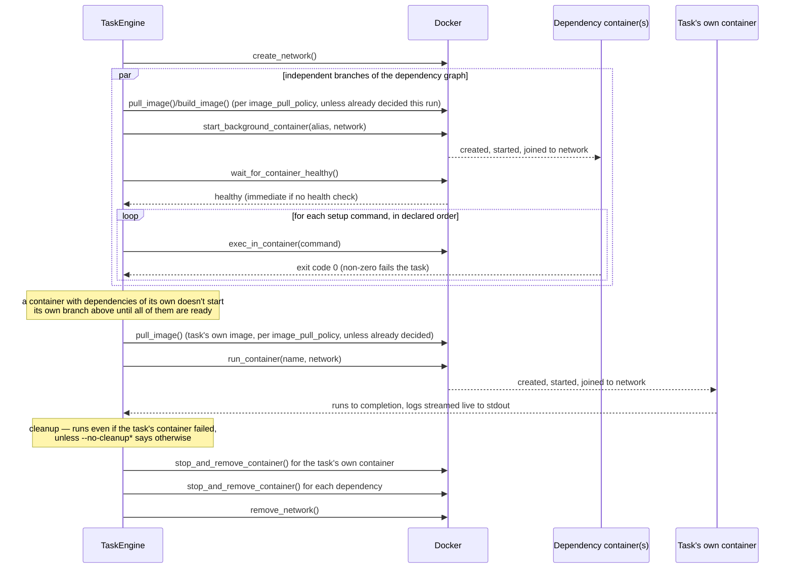

# Task Lifecycle

This is the detailed, step-by-step version of what `ratect run <task>` (or
`ratect-compat <task>` — the two binaries share one engine) actually does,
covering task ordering, per-task setup and cleanup in depth (what a dependency
has to pass before it counts as ready is on its own page — see [Dependency
Readiness](dependency-readiness.md)). For the
broader architecture (config loading, CLI parsing, logging), see
[how it works](how-it-works.md).

## Task ordering

Ratect only ever runs **one task's containers at a time**. A task's `prerequisites`
just order sequential task executions — each prerequisite task runs to completion
(including its own cleanup, described below) before the next one starts, and before
the originally-requested task itself runs.

```toml
[tasks.compile]
run = { container = "build-env", command = "./build.sh" }

[tasks.test]
prerequisites = ["compile"]
run = { container = "build-env", command = "./test.sh" }
```

Running `ratect run test` here runs `compile` to completion first, fully cleaning up
after it, then runs `test`.

A task doesn't strictly need a `run` of its own — a task with only `prerequisites`
is valid (see [config reference](ratect-compat-config-reference.md#task)), and exists purely to
chain other tasks together:

```toml
[tasks.ci]
prerequisites = ["compile", "test"]
```

Running `ratect run ci` here runs `compile` then `test` to completion, same as above,
then stops — there's no container of `ci`'s own left to run.

## Per-task steps

Every task execution gets its own Docker network, whether or not its container
declares `dependencies` — so a task's container is never left running on Docker's
shared default bridge network, reachable by or able to reach anything else on the
host. If the container *does* declare `dependencies`, those are started on that
network *before* the task's own container, so the task's container can reach them by
name — and so is anything named in the *task's own* `dependencies` (sidecars scoped
to this task specifically, distinct from the container-level field — see [config
reference](ratect-compat-config-reference.md#task)), unioned in alongside the container-level ones.
All of this — network, dependencies, and the task's own container — is scoped
to **this one task execution** and torn down before moving on, regardless of whether
the task succeeded — unless `--no-cleanup`/`--no-cleanup-after-failure`/
`--no-cleanup-after-success` says otherwise, in which case everything below is left
genuinely running instead, for investigation (see [CLI
reference](ratect-compat-cli.md)):


```mermaid
sequenceDiagram
    participant Engine as TaskEngine
    participant Docker
    participant Dep as Dependency container(s)
    participant Main as Task's own container

    Engine->>Docker: create_network()

    par independent branches of the dependency graph
        Engine->>Docker: pull_image()/build_image() (per image_pull_policy, unless already decided this run)
        Engine->>Docker: start_background_container(alias, network)
        Docker-->>Dep: created, started, joined to network
        Engine->>Docker: wait_for_container_healthy()
        Docker-->>Engine: healthy (immediate if no health check)
        loop for each setup command, in declared order
            Engine->>Docker: exec_in_container(command)
            Dep-->>Engine: exit code 0 (non-zero fails the task)
        end
    end

    Note over Engine: a container with dependencies of its own doesn't start<br/>its own branch above until all of them are ready

    Engine->>Docker: pull_image() (task's own image, per image_pull_policy, unless already decided)
    Engine->>Docker: run_container(name, network)
    Docker-->>Main: created, started, joined to network
    Main-->>Engine: runs to completion, logs streamed live to stdout

    Note over Engine: cleanup — runs even if the task's container failed,<br/>unless --no-cleanup* says otherwise
    Engine->>Docker: stop_and_remove_container() for the task's own container
    Engine->>Docker: stop_and_remove_container() for each dependency
    Engine->>Docker: remove_network()
```

If the container has no `dependencies`, the dependency steps (the `loop` above) are
skipped — but the network is still created and the task's own container still joins
it, isolating it just the same as a task with dependencies.

`--no-cleanup-after-failure` skips the cleanup step above for a genuine infrastructure
failure (a build/pull/health-check/setup-command failure, or anything else before the
task's own container gets to run); `--no-cleanup-after-success` skips it when the
task's own container ran to completion instead, regardless of its exit code (a
non-zero exit is still "success" for this purpose — it's the task's own container
actually running that matters, not what it returned); `--no-cleanup` is both at once.
Either way, everything above is left genuinely running, not just present-but-stopped
— see [CLI reference](ratect-compat-cli.md).

`pull_image()` in the diagram above is conditional on `image_pull_policy` (see [config
reference](ratect-compat-config-reference.md#container)): `IfNotPresent`, the default, checks whether
the image already exists locally first and skips the pull entirely if so; `Always`
skips that check and pulls unconditionally. Either way, the *decision* (pull or don't)
is made once per image name per `ratect` invocation, same as before this field
existed — a dependency and the task's own container sharing an image name don't
re-decide for each other.

Passing `--use-network <name>` skips network creation and teardown entirely for every
task in this invocation: the named network is checked to exist up front (a clear error
if it doesn't), and reused instead — dependencies and the task's own container all join
it exactly as they would a freshly-created one, but it's never removed at cleanup,
since Ratect didn't create it. See [CLI reference](ratect-compat-cli.md).

## Dependency resolution

What happens between `create_network()` and the task's own container starting
in the diagram above — how a dependency graph's independent branches start
concurrently, why a shared dependency starts once, and what a dependency has to
pass before anything that depends on it starts — is its own page: [Dependency
Readiness](dependency-readiness.md).

## Cross-task isolation

Because dependency resolution is scoped to a single task execution, **two different
tasks that each depend on the same container name get their own separate instance** —
nothing is shared or deduped across tasks, even within one `ratect` invocation:

```toml
[tasks.migrate]
run = { container = "app", command = "run-migrations.sh" }

[tasks.test]
prerequisites = ["migrate"]
run = { container = "app", command = "run-tests.sh" }
```

Both `migrate` and `test` here depend on `database` (via `app`'s container config).
Running `ratect run test` starts a `database` instance, its own network, runs `migrate`,
cleans both up — then starts a *second*, independent `database` instance and network
for `test`. This matches Batect's own documented behavior ("each task will start its
own instance of each container, even if multiple tasks share the same container") and
is also what makes concurrent `ratect` invocations on the same host safe: each task
execution's network is named with a random UUID, so there's no risk of two runs
colliding.

## Known limitations

- **The task's own container's readiness gate can race a fast main command** —
  and "main command" is usually a task-specific override. A task's
  `run.command`/`run.entrypoint` (see [TaskRun](ratect-compat-config-reference.md#taskrun))
  replaces whatever the container's own `command`/`entrypoint`, or the image's
  default `CMD`, would otherwise run — often to run a one-off command (`psql`,
  a one-shot migration script) against a container that's really built for
  something else, a long-running service. That override is what actually
  starts the instant the container starts. It is never gated on the
  container's own `health_check`/`setup_commands` — the task's own container
  goes through the same readiness gate a dependency does (health-check wait,
  then `setup_commands`, in order), but run
  *concurrently* with the main command rather than blocking it, because
  nothing else in the graph depends on the task container's own readiness. A
  setup command or health-check failure still fails the task even if the
  main command already succeeded — including a `health_check` written for
  the container's usual, non-overridden role, which a one-off command
  doesn't make go away. Whether that's the right behaviour for a task's own
  container specifically — nothing in this task's own graph actually depends
  on its readiness — is an open question, tracked in
  [ratect#173](https://github.com/or1can/ratect/issues/173).
  One race this doesn't close, matching Batect's own (its
  `RunStage` completion is driven purely by the container's exit event, not
  its readiness): a main command that exits very quickly — especially with
  no `health_check` configured, since the readiness gate then starts its
  `setup_commands` almost immediately after the container starts — can
  finish before a `setup_commands` entry gets a chance to `docker exec` into
  it, surfacing Docker's own "container is not running" error instead of
  that setup command's actual outcome. In practice this only bites a
  near-instant main command; anything taking more than a few tens of
  milliseconds gives the setup command time to run and report its real
  result. Also unlike Batect: the main command itself is never cancelled
  early just because the readiness gate fails first — it always runs to
  completion, and the task is still reported as failed overall either way.
- **Prerequisite tasks stay sequential, matching Batect exactly** — `prerequisites`
  entries run one after another, each to completion, never concurrently with each
  other or with the task that named them (see "Task ordering" above). This is Batect's
  own behavior (`TaskExecutionOrderResolver`/`SessionRunner`), not a Ratect
  simplification — Batect doesn't parallelize independent prerequisite tasks either.
  Running independent prerequisites concurrently remains a possible Rust-specific
  enhancement beyond Batect, tracked as
  [ratect#102](https://github.com/or1can/ratect/issues/102), not something planned.
- **Minimal networking.** The network created here exists only to make dependency
  containers reachable by name for the duration of one task (or, with
  `--use-network`, an existing network you reuse instead). It's not the
  fully-configurable Docker networking Batect offers (custom drivers, other than by
  pre-creating the network yourself) — see
  [differences from Batect](differences-from-batect.md).

Coming from Batect? Its own [task
lifecycle](https://github.com/batect/batect.dev/blob/main/docs/concepts/task-lifecycle.mdx)
page describes the model this one is a deliberately simplified version of;
the limitations above say where the two match and where they differ.
